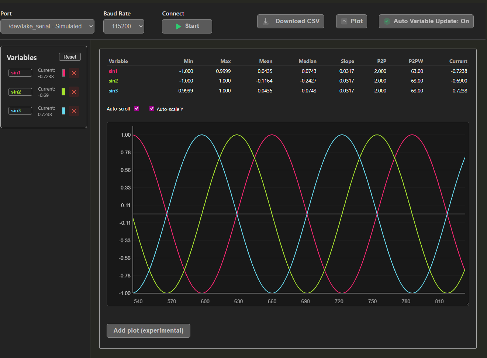
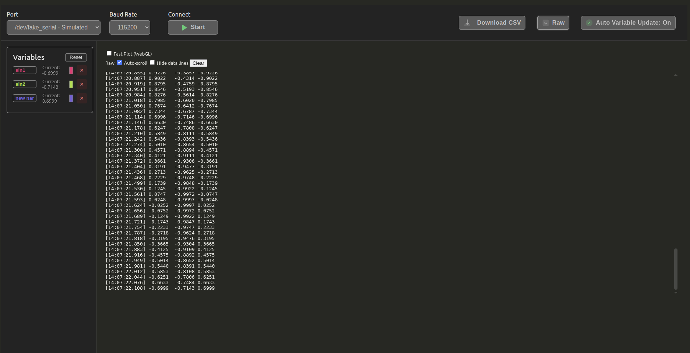

# Serial Plotter for VS Code

A powerful real-time data visualization extension for VS Code that plots numerical data received via serial ports. Perfect for monitoring Arduino sensors, ESP32 data streams, and other microcontroller projects. Integrates seamlessly with PlatformIO and other embedded development workflows.

## ✨ Key Features

- **Real-time plotting** with high-performance rendering
- **Multiple data format support** - automatic and manual parsing
- **Interactive plot controls** - zoom, pan, auto-scroll
- **Variable management** - customize colors, names, and visibility  
- **Statistics display** - min, max, and current values
- **Raw data monitoring** - view unprocessed serial output
- **CSV export** - save your data for further analysis
- **WebGL acceleration** - smooth plotting even with high data rates
- **Fake data simulation** - test without hardware

## 📸 Screenshots

### Main Plot View with Statistics


### Variable Management Sidebar  


### Raw Data Monitoring


## 🚀 Getting Started

### Opening the Plotter
1. Press `Ctrl+Shift+P` (`Cmd+Shift+P` on macOS) to open the command palette
2. Type "Serial Plotter: Open pane" and select the command
3. The plotter interface will open in a new VS Code panel

### Basic Usage
1. **Select your port** from the dropdown (click refresh if your device was connected after opening)
2. **Choose the correct baud rate** to match your device configuration  
3. **Click Start** to begin monitoring
4. **Switch between Plot and Raw views** using the toggle button
5. **Customize variables** in the sidebar (colors, names, visibility)

## 📊 Data Formatting

The Serial Plotter supports multiple data input formats to accommodate different use cases:

### Format 1: Header + Tab/Space Separated Values
Perfect for simple sensor readings:

```cpp
// Send a header line first (case-insensitive, optional colors)
Serial.println("header temp:'red' humidity:'blue' pressure:'green'");

// Then send data lines with tab or space separation  
Serial.print("23.5\t65.2\t1013.25");
Serial.println();
```

### Format 2: Named Variables with Colons
Explicit variable naming:

```cpp
// Data with variable names
Serial.println("temp:23.5 humidity:65.2 pressure:1013.25");
// or 
Serial.println("sensor1:123,sensor2:456,sensor3:789");
```

### Format 3: Auto-detection Mode
When "Auto Variable Update" is enabled, the plotter automatically creates variables for incoming numeric data:

```cpp
// Just send numbers - variables will be auto-created as line1, line2, etc.
Serial.println("1.23 4.56 7.89");
```

### Header Line Format Options
Headers can specify variable colors using various formats:

```cpp
// Different color specification methods:
Serial.println("header var1:'#FF0000' var2:'blue' var3:'rgb(0,255,0)'");
Serial.println("header temp:red humidity:blue");  
Serial.println("header sensor:'rgba(255,0,0,0.8)'");
```

### Arduino Example Code

```cpp
void setup() {
    Serial.begin(115200);
    
    // Optional: Send header with variable names and colors
    Serial.println("header temperature:'#e74c3c' humidity:'#3498db' light:'#f39c12'");
}

void loop() {
    float temp = 20.0 + 5.0 * sin(millis() * 0.001);
    float humidity = 50.0 + 10.0 * cos(millis() * 0.001);  
    int light = 500 + 200 * sin(millis() * 0.002);
    
    // Send tab-separated values
    Serial.print(temp); Serial.print("\t");
    Serial.print(humidity); Serial.print("\t");  
    Serial.print(light); Serial.println();
    
    delay(100);
}
```

## 🎛️ Interface Features

### Plot Controls
- **Auto-scroll**: Automatically follow new data (toggle on/off)
- **Zoom slider**: Adjust visible sample range (10 to 100k+ samples)  
- **Manual panning**: Click and drag to explore historical data
- **Y-axis controls**: Auto-scale or manual min/max values
- **Mouse wheel**: Zoom in/out (Shift+wheel to pan vertically)

### Variable Management
- **Custom colors**: Click color picker to change line colors
- **Display names**: Edit variable names for better readability
- **Current values**: Live display of latest values for each variable
- **Delete variables**: Remove unwanted data series
- **Reset**: Clear all variables and start fresh

### View Modes
- **Plot View**: Interactive graphs with statistics table
- **Raw View**: Monitor unprocessed serial data with filtering options
- **WebGL Mode**: High-performance rendering for demanding applications

### Data Export
- **CSV Download**: Export all collected data
- **Automatic timestamps**: Data includes collection timestamps  
- **Filtered export**: Hide data lines when exporting raw logs

## ⚙️ Advanced Configuration

### Baud Rate Support
Compatible with all standard baud rates:
- 9600, 19200, 38400, 57600, 115200 (most common)
- Up to 921600 for high-speed applications
- Custom rates supported by your hardware

### Performance Options
- **Fast Plot (WebGL)**: Enable for high data rates (>1000 samples/sec)
- **Sample limits**: Automatic data truncation prevents memory issues
- **Render throttling**: 30ms intervals (~30 FPS) for smooth performance

### Troubleshooting
- **Port Access**: Only one application can use a serial port at a time
- **Upload conflicts**: Stop monitoring before uploading new firmware
- **Data format**: Check that your device sends properly formatted data
- **Baud rate**: Ensure sender and receiver use matching baud rates

## 🔧 Development Features

### Fake Data Generator
Test the plotter without hardware using the built-in simulator:
1. Select `/dev/fake_serial` from the port dropdown
2. Click Start to generate sine wave test data
3. Perfect for development and demonstrations

### WSL Support
Use with Windows Subsystem for Linux:

```powershell
# In Windows PowerShell (as Administrator)
winget install dorssel.usbipd-win
usbipd list
usbipd bind --busid 1-13  # Replace with your device's bus ID
usbipd attach --wsl --busid 1-13
```

## 📝 Tips & Best Practices

1. **Start simple**: Begin with basic tab-separated values before using advanced features
2. **Use headers**: Define variable names and colors for better visualization
3. **Monitor data rates**: High-frequency data (>100Hz) works best with WebGL mode
4. **Regular exports**: Save important data sessions as CSV files
5. **Port management**: Always stop monitoring before uploading firmware

## 🐛 Known Limitations

- Serial ports are exclusive - cannot monitor while uploading firmware
- Variable configurations reset when starting new monitoring sessions  
- Very high data rates (>10kHz) may require WebGL mode for smooth rendering
- Color changes require reconnection to take effect in some cases

## 📄 License

MIT License - see LICENSE file for details.

## 🤝 Contributing

Issues and pull requests welcome! Visit the [GitHub repository](https://github.com/martijnvwezel/serial-plotter) to contribute.

---

*This README was written with assistance from Claude (Anthropic's AI assistant) to comprehensively document all features and capabilities.*